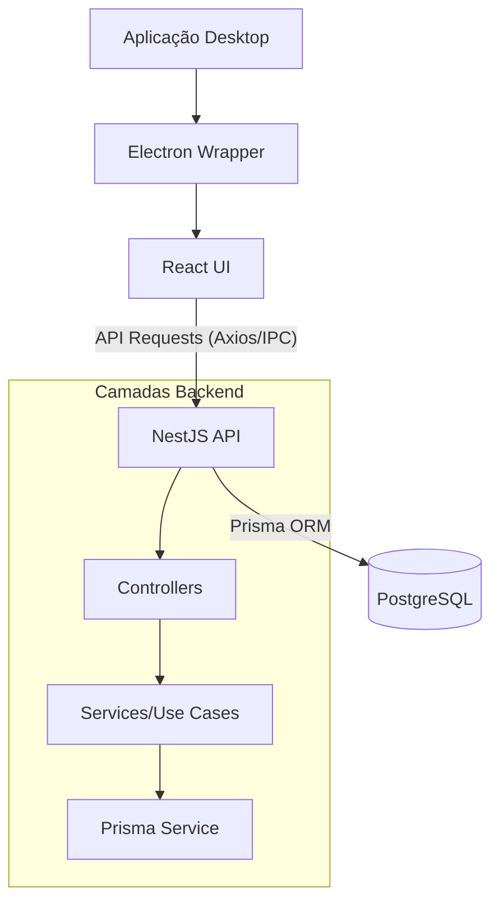

# 🏗️ Arquitetura do Sistema - Oliveira Equipamentos

Este documento descreve as decisões arquiteturais, padrões de código e a estrutura do projeto para garantir escalabilidade e manutenibilidade.

## 🎯 Princípios Gerais

Adotamos os princípios da **Clean Architecture** (Arquitetura Limpa) para manter o núcleo de negócio independente de infraestrutura (Banco de dados, Frameworks, UI).

### Camadas do Sistema

1.  **Entidades (Domain Basics):** Regras de negócio fundamentais e tipos de dados.
2.  **Casos de Uso (Services):** Lógica de negócio específica da aplicação. Coordena o fluxo de dados.
3.  **Adaptadores de Interface:** Controllers (REST), Gateways (Prisma) e Presenters.
4.  **Frameworks e Drivers:** NestJS, Electron, React, Bancos de dados.

---

## 🏗️ Estrutura de Pastas (Monorepo)

```text
oliveira-equipamentos/
├── packages/
│   ├── backend/          # API NestJS
│   │   ├── src/
│   │   │   ├── modules/  # Módulos por domínio (produtos, clientes, etc.)
│   │   │   ├── prisma/   # Configuração e service do banco de dados
│   │   │   └── common/   # Filtros, interceptors e decorators globais
│   ├── frontend/         # Aplicação React + Vite
│   │   ├── src/
│   │   │   ├── components/ # Componentes reutilizáveis (UI)
│   │   │   ├── hooks/      # Hooks customizados e lógica de estado
│   │   │   └── services/   # Comunicação com API e Electron
│   └── electron/         # Wrapper Desktop (Main process)
└── .github/              # Workflows de CI/CD
```

---

## 📊 Fluxo de Comunicação

O diagrama abaixo ilustra como os pacotes interagem entre si:



---

## 📜 Padrões de Código

### Backend (NestJS)
- **Nomenclatura:** PascalCase para Classes, camelCase para métodos e variáveis.
- **DTOs:** Obrigatórios para toda entrada de dados (Validation com class-validator).
- **Injeção de Dependência:** Sempre use o constructor para injetar services.
- **Tratamento de Erros:** Use as exceções nativas do NestJS (`NotFoundException`, `ConflictException`, etc.).

### Frontend (React)
- **Componentes:** Use componentes funcionais com Hooks.
- **Estado Global:** Zustand para estados simples e rápidos.
- **Data Fetching:** TanStack Query (React Query) para chamadas de API.
- **Estilização:** CSS Vanilla ou módulos CSS (evitar estilos inline).

### Geral
- **Lint & Prettier:** Obrigatório rodar antes de todo commit (Husky fará isso automaticamente).
- **Commits:** Siga o padrão [Conventional Commits](https://www.conventionalcommits.org/) (ex: `feat:`, `fix:`, `chore:`).

---

## 🚀 Próximos Passos
- Implementar a autenticação seguindo esses padrões.
- Criar o primeiro módulo de domínio (Equipamentos) refletindo a estrutura acima.
